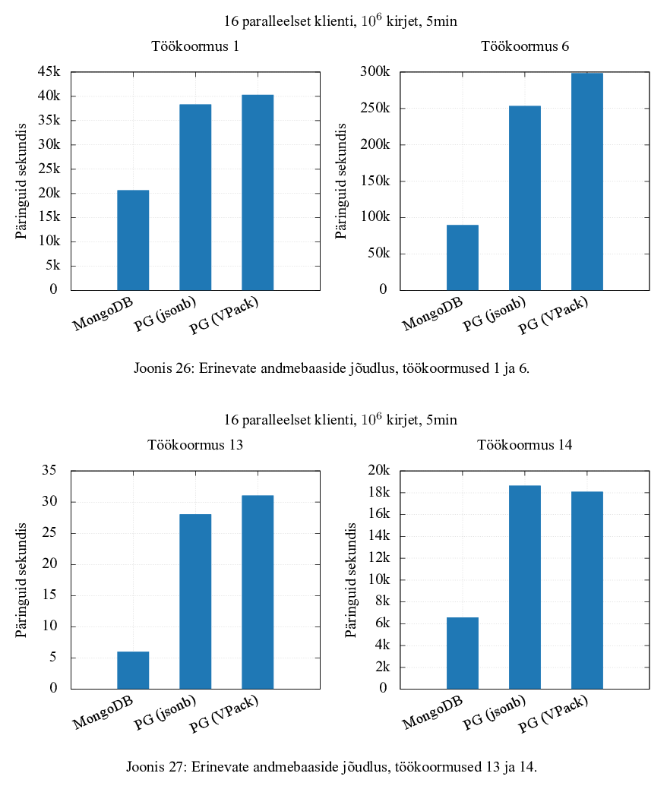

# PostgreSQL VelocyPack extension

This extension adds the [velocypack](https://github.com/arangodb/velocypack) format support to PostgreSQL. Generally it is a `jsonb` analogue with more data types and support for logical types or tags.

It supports most `jsonb_*` functions as `vpack_*`, `jsonpath` analogue `vpackpath` and conversion from the `json`, `jsonb` and `BSON` formats.

Some bits and pieces haven't been implemented yet.

## Advantages

  * more data types than JSON
  * same format for data processing, transport and storage
  * logical types or tagging: for more precise type or object document mapping

## Performance



  * 16 parallel clients, 10^6 records, 5 minutes
  * left axis: average requests per second
  * top left: inserts -- VPack is a bit faster, because it did not perform input validation
  * top right: selects by primary key -- VPack is faster due to lack of conversion to text
  * bottom left: a simple aggregate operation
  * bottom right: transactions

## TODO

  * finish tests
  * add tags and full type support to `vpackpath`
  * specify and implement conversions and tag IDs for all PostgreSQL types
  * implement missing `vpack_*` functions like `vpack_populate_record`, `vpack_to_recordset`, etc
  * [31f403e95fdf88338d3fc9c6af80fcf6d8241044](https://github.com/postgres/postgres/commit/31f403e95fdf88338d3fc9c6af80fcf6d8241044)
  * [a83586b5543b948f9e621462537a7303b113c482](https://github.com/postgres/postgres/commit/a83586b5543b948f9e621462537a7303b113c482)
  * [e56cad84d542a8cc2056390a9c651118cfa6c89c](https://github.com/postgres/postgres/commit/e56cad84d542a8cc2056390a9c651118cfa6c89c)
  * [1cff1b95ab6ddae32faa3efe0d95a820dbfdc164](https://github.com/postgres/postgres/commit/1cff1b95ab6ddae32faa3efe0d95a820dbfdc164)
  * [52ad1e659967896ed153185328ffe806d69abcb6](https://github.com/postgres/postgres/commit/52ad1e659967896ed153185328ffe806d69abcb6)
  * [7881bb14f4b23e8dc8671938cfb3f34117c12d8b](https://github.com/postgres/postgres/commit/7881bb14f4b23e8dc8671938cfb3f34117c12d8b)
  * [bffe1bd68457e43925c362d8728ce3b25bdf1c94](https://github.com/postgres/postgres/commit/bffe1bd68457e43925c362d8728ce3b25bdf1c94)
  * [6dda292d4df82a9158d1acc93feecf3b84637b59](https://github.com/postgres/postgres/commit/6dda292d4df82a9158d1acc93feecf3b84637b59)
  * [0a02e2ae0236103e641f6570b8135b7ee8a83686](https://github.com/postgres/postgres/commit/0a02e2ae0236103e641f6570b8135b7ee8a83686)

## Building

Install `bison`, `flex`, `cmake`, `gcc`.

```
git submodule update --recursive

(
	mkdir build-mongo
	cd build-mongo
	cmake -DCMAKE_C_FLAGS="-fPIC" ../mongo-c-driver/
	make -j 12
)

(
	mkdir build
	cd build
	cmake ..
	make -j 12
	make install
)
```

Then run `CREATE EXTENSION vpack;`. See `vpack--0.1.sql` for available functions, operators and casts.

